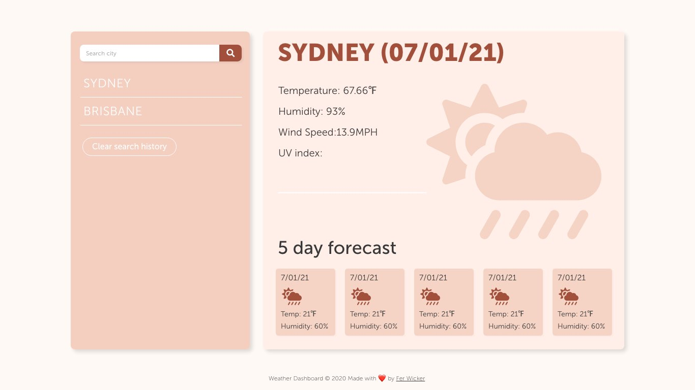

# Weather Dashboard
This simple weather dashboard lets you search cities and display their current weather and forecast. Mobile friendly design is ideal to search the weather on the go, it is also perfect to display at TV size in offices or travel agencies. Your search history is automatically saved so you're favourite cities are always just a click away.
[See deployed application.](https://ferwicker.github.io/weather-dashboard/)

## Table of contents
  - [Motivation](#motivation)
  - [Process](#process)
  - [Built with](#built-with)
  - [Features](#features)
  - [Credits](#credits)

## Motivation
Knowing the weather and checking forecasts is not only useful when you are planning to travel. As someone with friends and family scattered around the world, having easy access to the weather in their cities helps make me feel closer to them. Is my mum wearing a scarf today? I wonder if the mountains behind dad's house are snowy this morning. 

This weather dashboard presents basic weather information for any city in the world in a visually pleasant format and is easy to use.

## Process
As always, pencil (or pretty teal pen, in my case) comes before pixels (and code). The sketching stage for this project was simple, due to the brief being quite clear on structure. The Adobe XD design was quite faithful to the final product in this case, and I am very happy with how it turned out.

## Built with
- [Bootstrap](https://getbootstrap.com/)
- [JQuery](https://jquery.com/)
- [Moment.js](https://momentjs.com/)
- [Adobe XD](https://www.adobe.com/au/products/xd.html) (prototyping)

## Features
- Search any city and display it's current weather and 5 day forecast
- Autmatically save search history and display as list
- Navigate between different city weathers easily
- Delete individual cities from panel or clear full history
- Save search history to local storage and display last viewed city on load
- Minimalist modern design
- Modern weather icons replace default ones

### [See deployed application](https://ferwicker.github.io/weather-dashboard/)

## Credits
The weather icons, search icon and trash icon are from https://fontawesome.com/